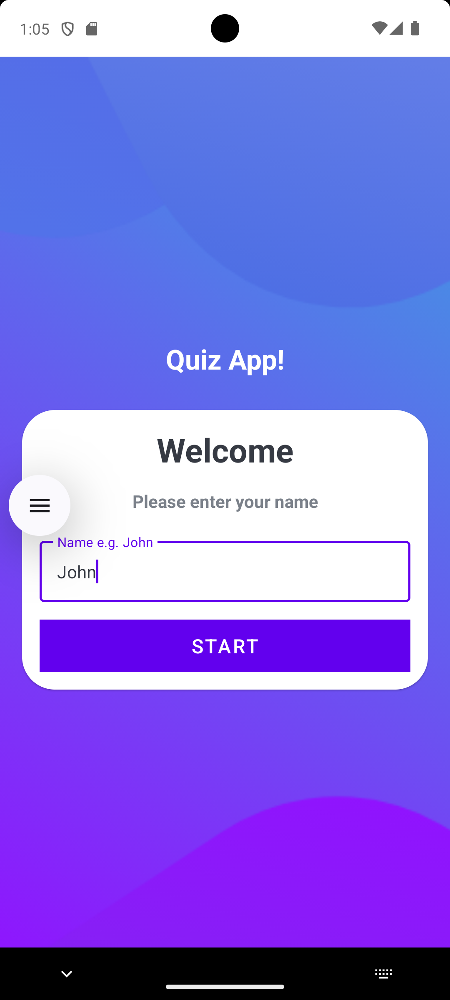
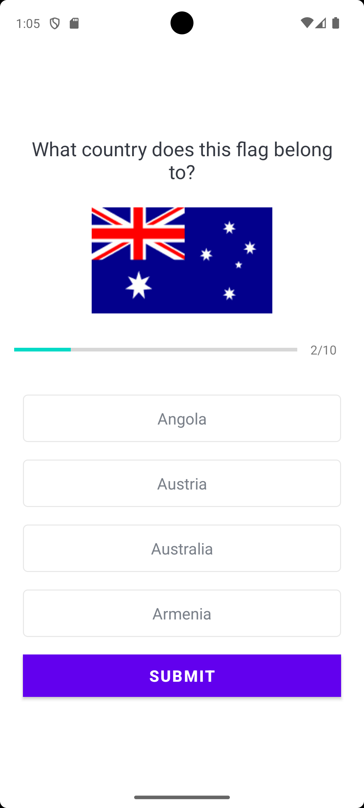
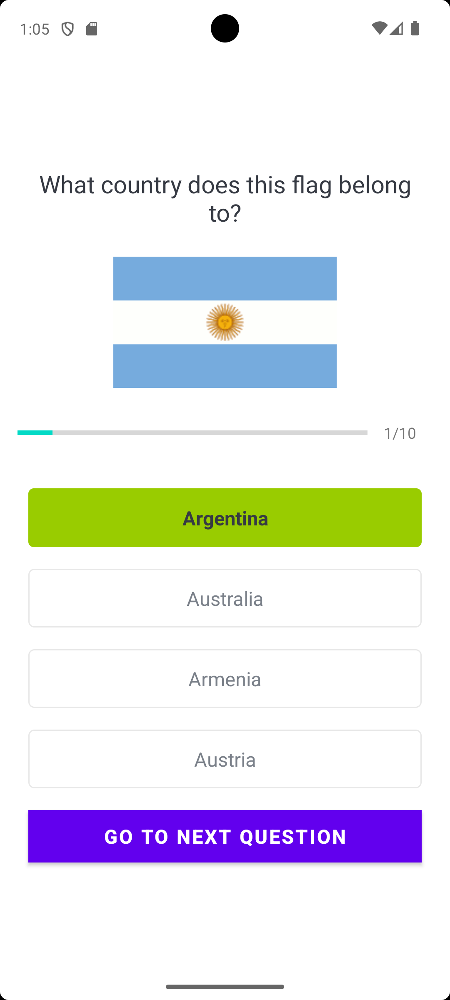
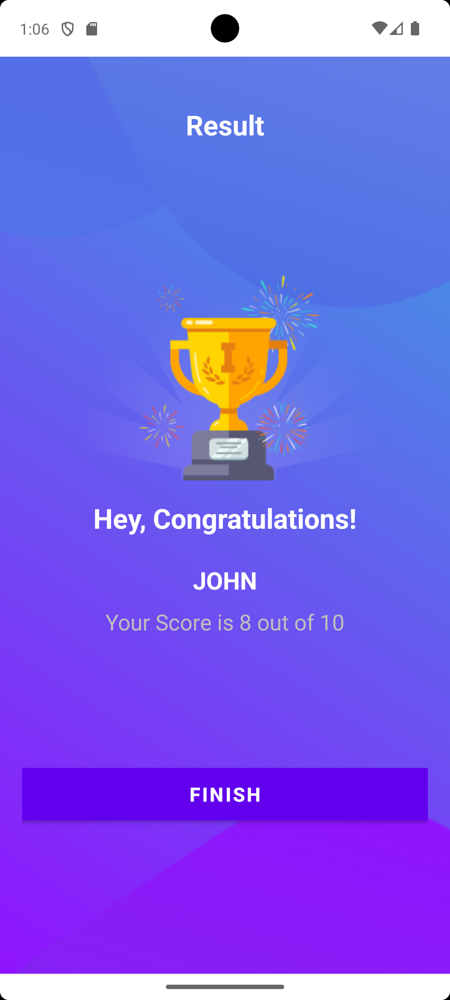

# 📱 # 🌍 Flag Quiz App

A simple and interactive Android Quiz Application built using **Kotlin** and **XML**. The app tests users on country flags by presenting multiple-choice questions, tracking progress, and displaying the final score at the end.

---

## ✨ Features

- 👤 Enter your name before starting the quiz
- 🏳️ Guess the country from its flag
- ✅ Multiple-choice questions
- 📊 Progress bar showing quiz completion
- 🎯 Instant answer validation
    - 🟢 Correct answer highlighted in green
    - 🔴 Incorrect answer highlighted in red
- 🏆 Final score screen
- 📱 Clean and responsive UI

---

## 📸 Screenshots

<p align="center">
  
  
</p>

<p align="center">
  
  
</p>

---

## 🛠️ Tech Stack

- **Language:** Kotlin
- **UI:** XML
- **Architecture:** Activity-based
- **RecyclerView**
- **View Binding**
- **Material Components**

---

## 📂 Project Structure

```
app
├── data
│   ├── Constants.kt
│   ├── Question.kt
│   └── Option.kt
│
├── adapter
│   └── OptionAdapter.kt
│
├── ui
│   ├── MainActivity.kt
│   ├── QuizQuestionsActivity.kt
│   └── ResultActivity.kt
│
└── res
    ├── drawable
    ├── layout
    └── values
```

---

## 🚀 Getting Started

1. Clone this repository

2. Open the project in Android Studio

3. Sync Gradle

4. Build and Run the application

---

## 📖 How it Works

1. Enter your name.
2. Press **Start**.
3. Answer all quiz questions.
4. Receive instant feedback after each answer.
5. View your final score on the result screen.

---

## 🔮 Future Improvements

- 🔀 Shuffle answer options
- ⏱️ Quiz timer
- 📈 High score tracking
- 🌍 More quiz categories
- 🎵 Sound effects
- 🌙 Dark Mode
- ☁️ Firebase leaderboard

---

## 🎓 What I Learned

This project helped me gain hands-on experience with:

- Kotlin programming
- RecyclerView and Adapters
- View Binding
- Activity navigation using Intents
- Handling user interactions
- Managing application state
- Dynamic UI updates
- Android layouts using XML

---

This project was developed as a learning project to practice Android development using Kotlin and XML.